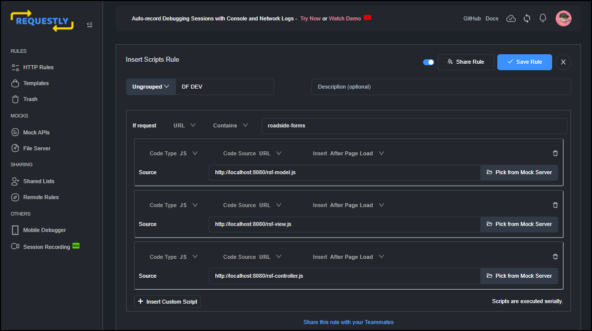
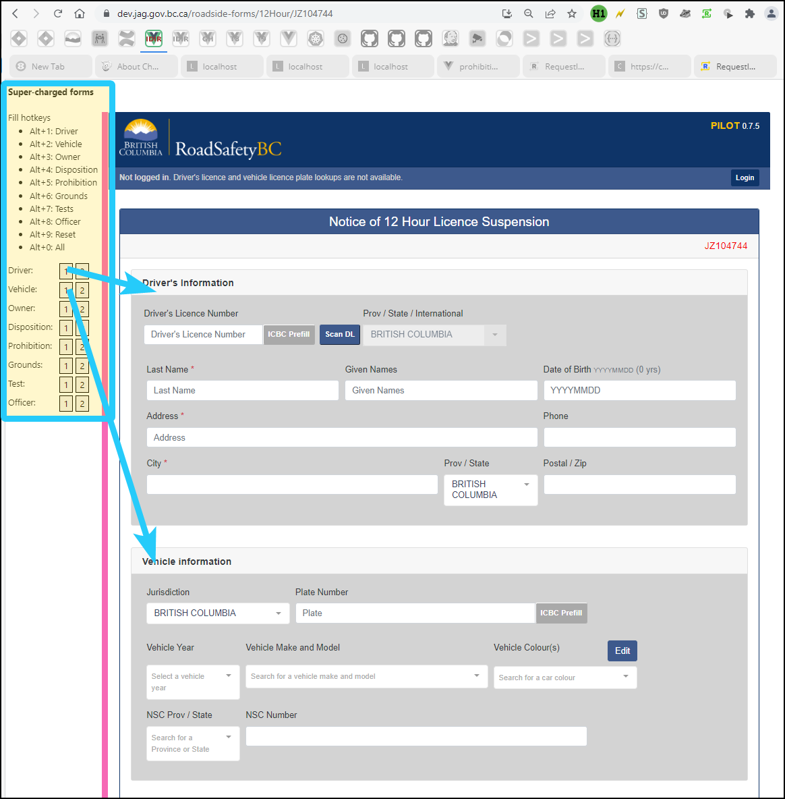
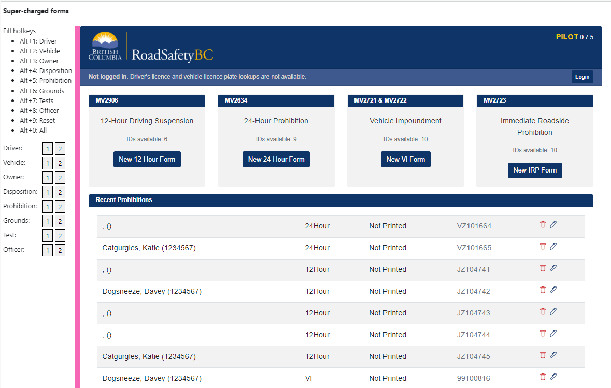

# Form automation

These scripts automate data entry on the road-side forms for manual (exploratory, intuitive) testing, demonstrations, day-to-day use, and regression testing (for example, end-to-end regression testing with TestCafe or Cypress).

- MV 2906: 12-hour suspension notice
- MV 2634: 24-hour prohibition notice
- MV 2721, 2722: vehicle impoundment
- MV 2723: immediate roadside prohibition

These scripts function in all environments:

 - [DEV](https://dev.jag.gov.bc.ca/roadside-forms/)
 - [TEST](https://test.jag.gov.bc.ca/roadside-forms/)
 - [PROD](https://jag.gov.bc.ca/roadside-forms/)

These environments are only accessible from the BC government network (office Ethernet, wifi, or IDIR VPN) and on-boarded municipal or federal police networks.

## Purpose

These scripts allow complex forms to be filled out programmatically. The roadside forms are built using Vue.js as a Vuex single page application (SPA). Vue allows developers to quickly create good-looking, reliable, complex web forms, and uses advanced JavaScript concepts and objects. 

However, filling out Vuex forms with automated tools is non-trivial, but essential to reduce time and human error while working with the forms during development, test, and demonstration activities. 

The scripts allow form sections to be filled out with pre-configured data using a hotkey or keypress, or as part of an automated test suite.

## Scripts

There are currently three scripts:

- [rsf-model.js](rsf-model.js): the values to be entered into the form (the "model").
- [rsf-view.js](rsf-view.js): buttons and labels overlayed onto the road-side forms (the "view").
- [rsf-controller.js](rsf-controller.js): code to simulate filling out form fields (the "controller").

These scripts can be injected onto the form page using a proxy like [Requestly](https://requestly.io). Many other browser extensions and proxy tools exist. Requestly will also mock API requests, allowing ICBC look-ups to also be simulated.

## Configuration

Inject the scripts in Requestly by going to **HTTP Rules** > **+ New Rule** > **Insert Scripts**. On the **Insert Scripts Rule** page, configure three JavaScripts to load from URL and be inserted after page load if request URL contains `roadside-forms`. For example:

As Chromium does not permit extensions to access local files, you can set up a web server to host the files locally, or pull them directly from this GitHub project. 

## Example

In the screenshot below, you can see the menu overlaid on the 12-hour form. You can fill sections of the form by clicking on the buttons in the list (for example, clicking '1' next to Driver fills in the driver section with data from scenario 1, clicking '2' next to driver fills in the driver section with data form scenario 2. Pressing hotkey Alt+1 fills in the driver section with scenario 1. Pressing hotkey Alt+0 fills in all fields on the form. Pressing hotkey Alt+9 resets all fields to when the form was loaded.

This animated capture illustrates how quickly the form is filled:

## Research

While working on this ticket, I created a question on [government Stack Overflow](https://stackoverflow.developer.gov.bc.ca/questions/809/826) and the [Vue.js](https://forum.vuejs.org/t/how-to-simulate-user-interaction-in-a-vuex-single-page-web-app-using-javascript/132345/2) forums. You may wish to review the question and answer for more detail about how this works. There may be a new useful answer posted that suggests an alternative method to automate these forms.